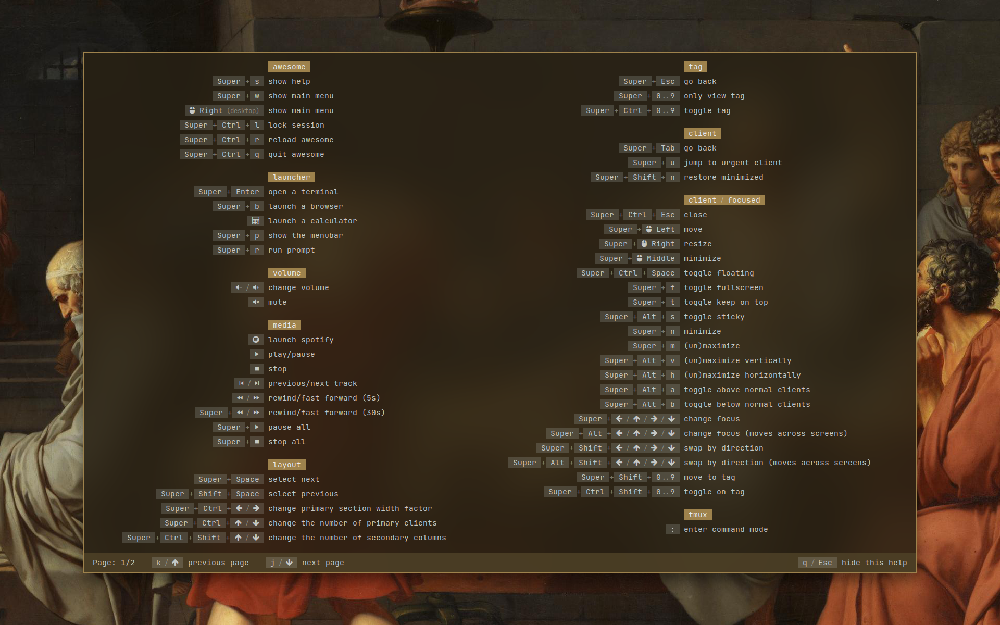

# Powerful

A simple popup widget for [Awesome window manager](https://github.com/awesomeWM/awesome) which shows current bindings and their descriptions. Inspired by default Awesome hotkeys popup.



# Features

What is different from default Awesome hotkeys popup:

- simple search (search in binding's description)
- groups can be nested (tree structure)
- matched groups with rules are shown first
- custom group/binding order

# Installation

Copy source files to `powerful` directory in your Awesome config directory (e.g. `~/.config/awesome/powerful`)

    git clone https://github.com/kosorin/powerful.git ~/.config/awesome/powerful

# Quick start

1. Include `powerful` into your config file (`rc.lua`)

    ```lua
    local powerful = require("powerful")
    local mod = powerful.binding.modifier
    ```

2. Create a new `help` instance

    ```lua
    local help = powerful.help.new()
    ```

3. add bindings

   - Custom bindings

       Add a group with custom bindings

       ```lua
       help:add_group {
           name = "firefox",
           ruled = { rule_any = { class = { "firefox", "Firefox" } } },
           { modifiers = { mod.alt }, from = "1", to = "9", description = "go to tab" },
           { modifiers = { mod.control }, "t", description = "new tab" },
           { modifiers = { mod.control }, "w", description = "close tab" },
           { modifiers = { mod.control }, "Tab", description = "next tab" },
           { modifiers = { mod.control, mod.shift }, "Tab", description = "previous tab" },
       }
       ```

   - Awesome bindings

      By default Awesome bindings are shown with custom bindings.
      However they must be created using this library.

      So instead of this:

      ```lua
      awful.keyboard.append_global_keybinding(
          awful.key {
              modifiers = { mod.super },
              key = "Return",
              group = "launcher",
              description = "open a terminal",
              on_press = function() awful.spawn("alacritty") end,
          }
      )
      ```

      Use this:

      ```lua
      powerful.binding.add_global(
          powerful.binding.new {
              modifiers = { mod.super },
              triggers = "Return",
              path = "launcher",
              description = "open a terminal",
              on_press = function() awful.spawn("alacritty") end,
          }
      )
      ```
    
4. Show popup

    ```lua
    help:show()
    ```

# Usage/examples

## Triggers

```lua
powerful.binding.new { triggers = "Return" } -- Enter key
```
```lua
powerful.binding.new { triggers = 1 } -- Left mouse button
local btn = powerful.binding.button -- named buttons
powerful.binding.new { triggers = btn.left }
```
```lua
powerful.binding.new {
    triggers = { btn.left, btn.right } -- Left and right mouse button
}
```
```lua
powerful.binding.new {
    triggers = powerful.binding.group.fkeys, -- a trigger group
}
```
```lua
powerful.binding.new { "q", "w", "e" }
powerful.binding.new { triggers = { "q", "w", "e" } }
powerful.binding.new { 
    triggers = { -- custom trigger group
        { trigger = "q", foo = "bar", }, -- custom data
        { trigger = "w", },
        { trigger = "e", },
    },
}
```

## Callbacks

First parameter of `on_press` and `on_release` callback is always `trigger`.

```lua
powerful.binding.add_client(
    powerful.binding.new { 
        triggers = {
            { trigger = "q", foo = 4, bar = 8, },
            { trigger = "w", foo = 15, bar = 16, },
            { trigger = "e", foo = 23, bar = 42, },
        },
        -- note that the client is the second parameter
        on_press = function(trigger, c) 
            print(trigger.foo, trigger.bar)
        end,
    }
)
```

## Custom order

```lua
help:add_group {
    name = "firefox",
    order = 10,
}

powerful.binding.new {
    order = 20,
}
```

## Groups

```lua
help:add_group {
    name = "tmux", -- name property is required,
    groups = { -- nested groups
        {
            name = "panes",
        }
    },
}

powerful.binding.new { path = "tmux" }
powerful.binding.new { path = { "tmux", "panes" } }
```

```lua
help:add_group {
    name = "tmux",
    ruled = { rule_any = { class = { "firefox", "Firefox" } } },
}
```

## Style

In `theme.lua`

```lua
theme.help_* = ...
```
or

```lua
local help = powerful.help.new {
    style = {
        width = dpi(1200),
        height = dpi(800),
        columns = 2,
        padding = dpi(16),
        spacing = dpi(8),
        bg = theme.bg_normal,
        fg = theme.fg_normal,
        status_bg = theme.bg_focus,
        status_fg = theme.fg_focus,
        status_spacing = dpi(32),
        search_highlight_bg = theme.help_search_highlight_bg,
        search_highlight_fg = theme.bg_urgent,
        search_dim_bg = theme.help_search_dim_bg,
        search_dim_fg = "#818181",
        search_cursor_bg = theme.fg_focus,
        search_cursor_fg = theme.bg_focus,
        search_cursor_underline = "none",
        border_width = theme.border_width,
        border_color = theme.border_color_active,
        group_bg = theme.bg_focus,
        group_fg = theme.fg_focus,
        group_ruled_bg = theme.bg_urgent,
        group_ruled_fg = theme.fg_urgent,
        opacity = 1,
        shape = nil,
        labels = {},
    },
}
```
